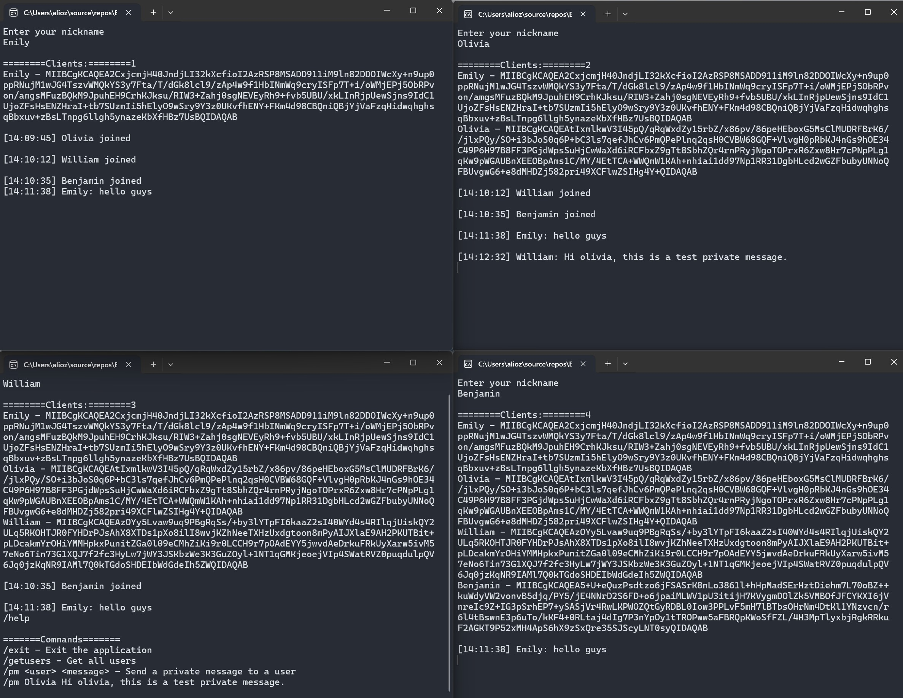

# End-to-End Encrypted SignalR Chat Application Example

End-to-End Encrypted  SignalR Chat App is a chat socket application that provides end-to-end encryption for secure messaging. Developed using SignalR, it ensures that messages are securely transmitted and can only be decrypted by the intended recipients.

## Purpose

The purpose of End-to-End Encrypted Chat App is to enable users to communicate securely. By offering end-to-end encryption, it creates a communication environment where messages can only be read by the sender and the recipient. This solution aims to preserve the privacy and integrity of user data by preventing unauthorized access or tampering by third parties.

## How It Works

End-to-End Encrypted  SignalR Chat Application follows the following basic steps to facilitate encrypted messaging between users:

1. Users generate a public-private key pair upon login. The public key is used to encrypt messages with other users, while the private key enables users to decrypt messages.

2. When a user wants to send a message, they encrypt the message using their private key and the recipient's public key, creating an encrypted message that can only be decrypted with the recipient's private key.

3. The encrypted message is transmitted to the recipient via the SignalR socket. The recipient decrypts the message using their private key and views its contents.

This process ensures end-to-end encryption of messages, creating a secure and confidential communication environment.

## Requirements

- .NET Core SDK
- Visual Studio Code or a similar IDE
- SignalR library

## Usage Scenarios

End-to-End Encrypted  SignalR Chat App enables the following usage scenarios:

- Users can engage in real-time communication through securely encrypted messages.
- Message senders encrypt messages in a way that only the recipient's private key can decrypt, ensuring message confidentiality and integrity.
- Each user can share their public key with others and read their messages.

This is an example Readme file for the End-to-End Encrypted SignalR Chat App project. You can customize it according to your project's specifics and add more details if needed.

